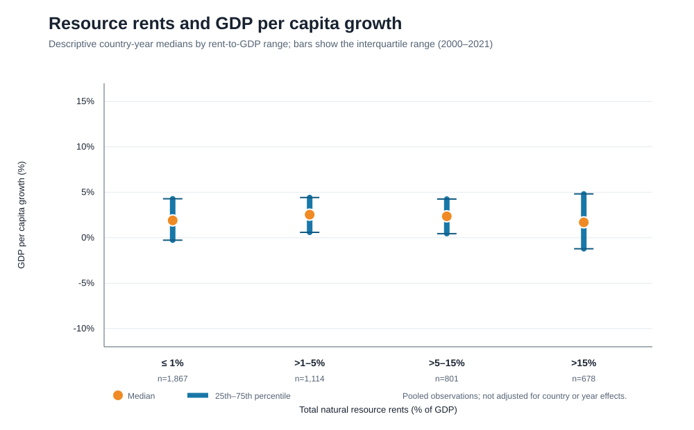
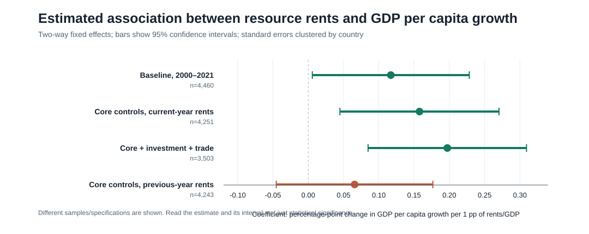

# ร่าง proposal: การพึ่งพาทรัพยากรธรรมชาติกับการเติบโตและผลลัพธ์การพัฒนา

## 1. คำถามวิจัย

1. ภายในประเทศเดียวกัน การเปลี่ยนแปลงของค่าเช่าทรัพยากรธรรมชาติต่อ GDP สัมพันธ์กับการเปลี่ยนแปลงของการเติบโต GDP ต่อหัวหรือไม่?
2. ความสัมพันธ์ดังกล่าวเปลี่ยนไปหรือไม่เมื่อควบคุม GDP ต่อหัวในปีก่อนและการเติบโตของประชากร?
3. ค่าเช่าทรัพยากรในปีก่อนสัมพันธ์กับการเติบโต GDP ต่อหัวของปีถัดมาหรือไม่?
4. ค่าเช่าทรัพยากรสัมพันธ์กับช่องว่างความยากจน ความเหลื่อมล้ำรายได้ และเสถียรภาพทางการเมืองอย่างไร?
5. ผลลัพธ์แตกต่างกันหรือไม่เมื่อแยกค่าเช่าตามน้ำมัน ก๊าซ ถ่านหิน แร่ และป่าไม้?

## 2. แรงจูงใจ

ทรัพยากรธรรมชาติสร้างรายได้และโอกาสทางเศรษฐกิจ แต่การพึ่งพารายได้จากทรัพยากรสูงอาจเชื่อมโยงกับความผันผวน การกระจุกตัวของเศรษฐกิจ หรือความท้าทายในการกระจายผลประโยชน์ แนวคิด resource curse จึงชวนให้ตรวจว่าความสัมพันธ์ที่พบสอดคล้องกับสมมติฐานด้านใด และผลลัพธ์เป็นแบบเดียวกันในทุกมิติหรือไม่

สถิติเบื้องต้นจากข้อมูล 2000–2021 มีค่าเฉลี่ย resource rents รวม 6.61% ของ GDP และมัธยฐาน 1.64% จาก 4,535 country-years. ค่าเฉลี่ยการเติบโต GDP ต่อหัวเท่ากับ 1.94% และมัธยฐาน 2.12% จาก 4,555 country-years. การกระจายของ resource rents เบ้ขวา โดยค่าสูงสุด 88.59% ของ GDP จึงต้องตรวจ outliers และรายงานค่ามัธยฐานควบคู่กับค่าเฉลี่ย

ผลเริ่มต้นจาก two-way fixed effects พบ resource rents สัมพันธ์เชิงบวกกับ GDP ต่อหัวเติบโตในแบบจำลองควบคุมหลัก (สัมประสิทธิ์ 0.158, p=0.006, n=4,251) แต่ค่า resource rents ปีก่อนไม่มีความสัมพันธ์ที่ชัดเจนทางสถิติในแบบจำลองเปรียบเทียบ lag (สัมประสิทธิ์ 0.066, p=0.246). ผลนี้เป็นหลักฐานเบื้องต้น ไม่ใช่ข้อสรุปเชิงเหตุและผล

## 3. แผนข้อมูลและวิธีวิเคราะห์

ใช้ World Development Indicators ของ World Bank ในช่วงปี 2000–2021 โดยตัวแปรหลักคือ Total natural resources rents (% of GDP). ผลลัพธ์หลักคือ GDP per capita growth. ผลลัพธ์เสริม ได้แก่ GDP growth, poverty gap at $3/day (2021 PPP), Gini index และ political stability score (0–100). ตัวควบคุมหลักคือ log GDP per capita ปีก่อนและ population growth. แบบจำลองขยายเพิ่ม gross capital formation และ trade โดยระบุว่าอาจเป็นช่องทางผ่านกลาง

หน่วยวิเคราะห์คือ country-year; ตัด regional/income aggregates; รวมด้วย Country Code และ Year; ไม่เติม missing values. ประมาณ two-way country/year fixed effects และจัดกลุ่ม standard errors ตามประเทศ. ใช้ complete cases ตามตัวแปรในแต่ละ specification และรายงานจำนวนประเทศ-ปีทุกครั้ง

## 4. สถิติเชิงพรรณนาเบื้องต้น

| ตัวแปร | N | ค่าเฉลี่ย | มัธยฐาน | SD | ต่ำสุด | สูงสุด |
|---|---:|---:|---:|---:|---:|---:|
| Total resource rents (% GDP) | 4,535 | 6.61 | 1.64 | 10.89 | 0.00 | 88.59 |
| GDP per capita growth (%) | 4,555 | 1.94 | 2.12 | 5.84 | -55.29 | 91.78 |
| GDP growth (%) | 4,555 | 3.28 | 3.50 | 5.95 | -54.40 | 86.83 |
| Poverty gap, $3/day (2021 PPP) (%) | 1,703 | 3.64 | 0.50 | 7.68 | 0.00 | 65.30 |
| Gini index (0–100) | 1,703 | 36.84 | 35.00 | 8.17 | 23.20 | 65.00 |
| Political stability score (0–100) | 4,240 | 65.34 | 66.40 | 16.88 | 13.76 | 95.95 |

ตารางนี้คำนวณจากข้อมูลที่ไม่ missing ของแต่ละตัวแปร จึงมี N ต่างกันและไม่ได้หมายความว่าทุกแถวมีข้อมูลครบทุกตัวแปร

## 5. กราฟเบื้องต้น

กราฟด้านล่างใช้ประกอบแรงจูงใจและผลวิเคราะห์เบื้องต้น กราฟแรกสรุปข้อมูลดิบเป็นช่วง ไม่ได้ควบคุมตัวแปรอื่น กราฟที่สองแสดงค่าประมาณจากแบบจำลองพร้อมช่วงความเชื่อมั่น 95% และขนาดตัวอย่าง

ควรตรวจ outliers และคุณภาพการแสดงผลก่อนส่ง โดยกราฟสัมประสิทธิ์ระบุช่วงความเชื่อมั่น ส่วนกราฟข้อมูลดิบใช้ช่วงควอไทล์ ไม่ควรอธิบายกราฟดิบว่าเป็นผลควบคุมหรือเหตุและผล

## 6. ขอบเขตและข้อจำกัด

ค่าเช่าทรัพยากรต่อ GDP วัดการพึ่งพาทรัพยากรเชิงสัดส่วน ไม่ใช่ปริมาณสำรองทรัพยากรโดยตรง ตัวหาร GDP อาจสร้างความสัมพันธ์เชิงกลกับผลลัพธ์ทางเศรษฐกิจ Fixed effects ลดปัจจัยคงที่เฉพาะประเทศและเหตุการณ์ร่วมรายปี แต่ไม่ตัดตัวแปรกวนที่เปลี่ยนตามเวลาออกทั้งหมด ข้อมูล poverty และ Gini มีความถี่/ความครอบคลุมต่ำกว่า จึงได้ตัวอย่างวิเคราะห์เล็กกว่า
